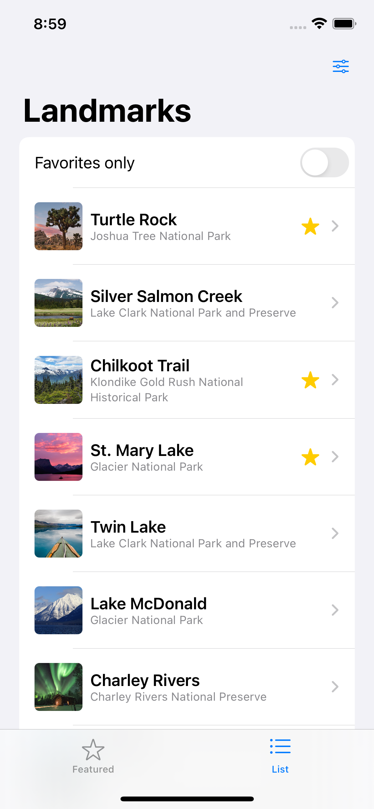
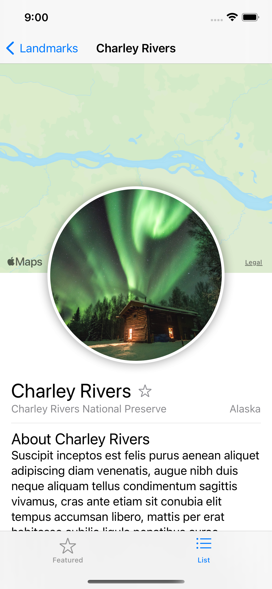
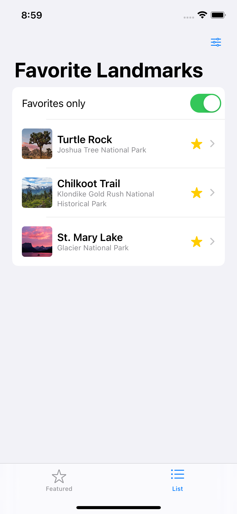
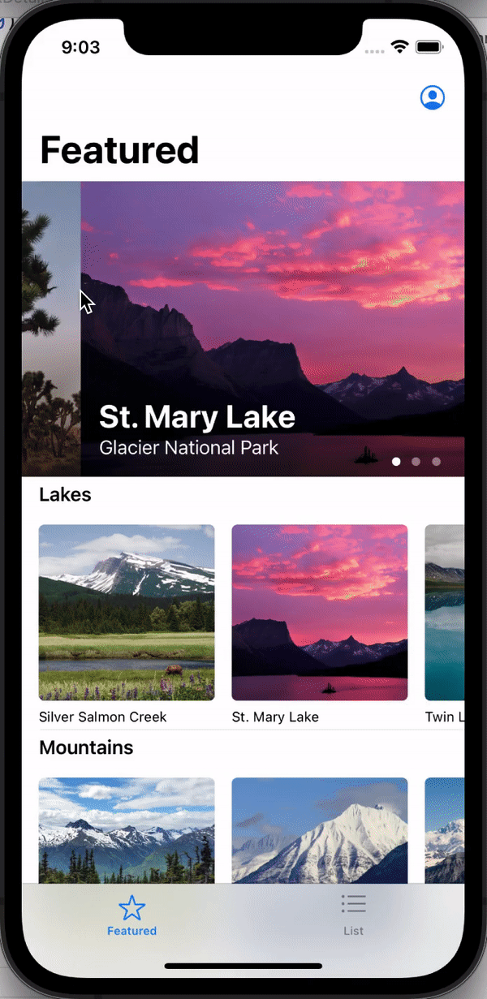
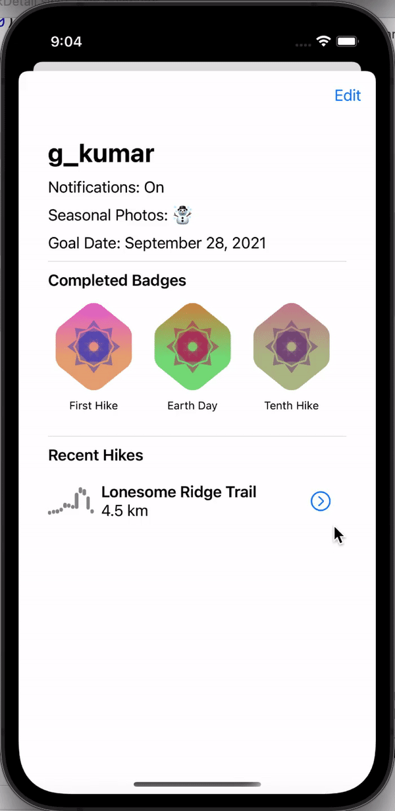

# Hack Technology / Project Attempted

## What you built? 

Over the summer I worked on an internship building an app using Objective-C in Xcode. However, a lot of the files where connected to Swift files. Even though I never got to work on them, they were available for me to read and try to understand. However, since I didn't know the language I couldn't read over them; for this reason, I decided to follow a tutorial to learn Swift. 

By following the Swift Essentials tutorial provided by Apple, I created an iOS app using Swift and SwiftUI on the Xcode platform. This tutorial built *Landmarks*, an app for discovering and sharing the places you love. It displays locations of parks and rivers and their location with an interactive map. It saves your recent hikes, heart race, and pace as well as allows you to collect badges from visiting locations. Here are some of the interfaces I built:

Full list of landmarks

Detailed view of a location

When the star is selected in the detailed view, the location is marked as a favorite. This allows the list view to sort the into a separate list

The featured view, with a horizontal scroll

A profile page that shows your badges, your recent hikes with elevantion, heart rate and pace with a cool animation between them

## What you learned

I learned the following: 
* How to create a SwiftUI view
* The difference between HStack and VStack
* How to use modifier methods to configure a view
* How to handle user input
* How to draw geometric shapes
* How to crop an image (like into a circle)
* How to animate transitions
* How to use UI Controls
* How to, very basically, create a macOS and watchOS version

### What did work
The tutorial as a whole was great as an introduction to swift when designing an iOS application. I managed to learned the essentials of swift, how to use several UI sources, and creating the app design and layout. Moreover, the tutorial had nice summarizing "quizzes" at the end of each section to see if you had fully understood a concept.

### What didn't work
However, one thing I really disliked about this tutorial was the ending. I didn't expect the tutorial to also adapt the app to a macOS App and a watchOS App which was a great surprise. However, these last two tutorials seemed rushed and filled with too much information. I would have liked the tutorial to simply focus on the iOS app and then offer two other tutorials where the same application is built for the different frameworks. I really don't think I could create an application for macOS or watchOS from the information given but I could create one of iOS. 

Overall, I really enjoyed learning Swift and I believe it's a language that's currently growing in use and will be helpful to know in my future career. Moreover, Swift is very easy to work with compared to other languages. It has clear distinctions between views and controllers by separating the files, making it easier to understand the format of the project. I can imagine how it would make working as a team much easier. 

## Files 

* At the header of each file, there is a small description about what the file's purpose is. 
* Model Folder: given files used to simulate user data
* Resources Folder: given data used throughout the application

## Who did what

Worked alone on the project.

## Authors

* Maria Mora Bolaños

## Acknowledgments

Based on Apple's "Introducing SwiftUI"
tutorial found:
https://developer.apple.com/tutorials/swiftui#swiftui-essentials
